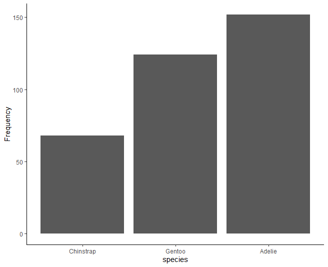
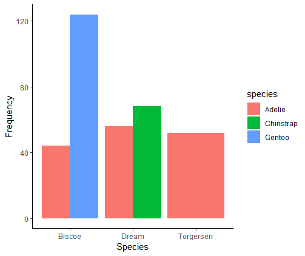

```{r, include=FALSE}
library(tidyverse)
library(palmerpenguins)
library(grateful)
```

## Title

### The islanders: a mock analysis on penguin distribution in three different islands.

### Abstract

What can I say. There is available data of penguins in R that is not mine but is free to use. There is an assignment about data reproducibility that requires you to copy what I have done. This is me trying to accomplish that and not destroy my chances of graduating in the process. I hope it works.

### Introduction

You know how introductions go. Start kind of broad on the topic, then narrow down without pushing it too much. Insert claims from others that help support your thesis [@cahill2013; @carey2003; @harvey2023]. Then repeat it but make it more specific and add more citations.

Lastly finish it with an statement on the purpose of the paper and study, which in this case is to create a repository and a reproducible research that you can, hopefully, repeat. Related to the data, our hypothesis is that there is a higher probability of finding one penguin species in relation with the island where we are surveying.

### Methods

Using data available in the *palmerpenguins* package in R, we extracted the data to two separate CSV files and stored them in a *rawdata* folder. From these data frames the one named "penguins" was selected to so some data manipulation, result production and storage.

Firstly, we created a frequency table that showed us the relative frequency of each species of penguins that was scouted and studied in the Palmer research station. This was done to create a plot and store the data created in a different folder named *tidydata*.

The barplot for the proportion of penguins was created using the function *geom_bar* from the *ggplot* package.

We (I guess I am not used to the I) proceed to do a contingency table for the penguins found per island and stored it in the same *tidydata* folder. From this data, another barplot was created similarly to the one above.

The first part of this is totally redundant. I'm just not very smart, so yeah... also, too lazy to erase it, but apparently not enough to write about it? even though that would have been faster and easier?

Another contingency table was produce from the penguins data to ensure that we did not violated assumptions for a $\chi^{2}$ contingency test and stored in the *figures* directory as a result.

Lastly, a $\chi^{2}$ contingency test was done using the *chisq.test* function from the *janitor* package. That's it.

### Results

Here be mine results.



It appears that Adelie pinguins are the most abundant in the dataset. Now let's see if there are differences among islands:

Table 1: Individuals count per island that are part of the "palmerpenguins" package.

| island    | Adelie | Chinstrap | Gentoo | Total |
|:----------|-------:|----------:|-------:|------:|
| Biscoe    |     44 |         0 |    124 |   168 |
| Dream     |     56 |        68 |      0 |   124 |
| Torgersen |     52 |         0 |      0 |    52 |
| Total     |    152 |        68 |    124 |   344 |

and in a graph:

{width="508"}

We did not violated any assumptions for the $\chi^{2}$ test, so we can say that the probability of being finding one penguin species is significantly associated with the island where we are surveying ($\chi^{2}$ contingency test; *df* = 4; $\chi^{2}$ = 299.55; *P* \< 0.001). Based on our bar plot (Fig. 2), the distribution of penguins is vastly different among islands.

Cheers.

### Discussion

We, indeed did found that penguin species is related to the island where they are surveyed. Shocking. I do not know what else to say, mate. *Torgersen* are everywhere, and both *Dream* and *Biscoe* are locked to particular islands. Neat.

### Tables

Table 1: Individuals count per island that are part of the "palmerpenguins" package.

| island    | Adelie | Chinstrap | Gentoo | Total |
|:----------|-------:|----------:|-------:|------:|
| Biscoe    |     44 |         0 |    124 |   168 |
| Dream     |     56 |        68 |      0 |   124 |
| Torgersen |     52 |         0 |      0 |    52 |
| Total     |    152 |        68 |    124 |   344 |

### Figure captions

Fig. 1: Species frequency in the penguins dataset.

Fig. 2: Species distribution across islands in the 'palmerpenguins' package.

### Figures

\newpage


\newpage


\newpage

### Appendices

See the PREE.R script for how this was done?

### References

```{r echo=FALSE}
cite_packages(output = "paragraph", out.dir = getwd())
```
